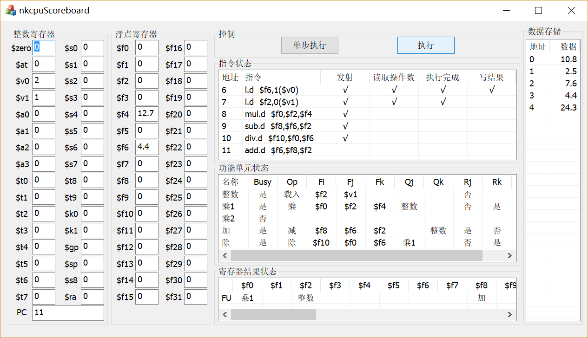
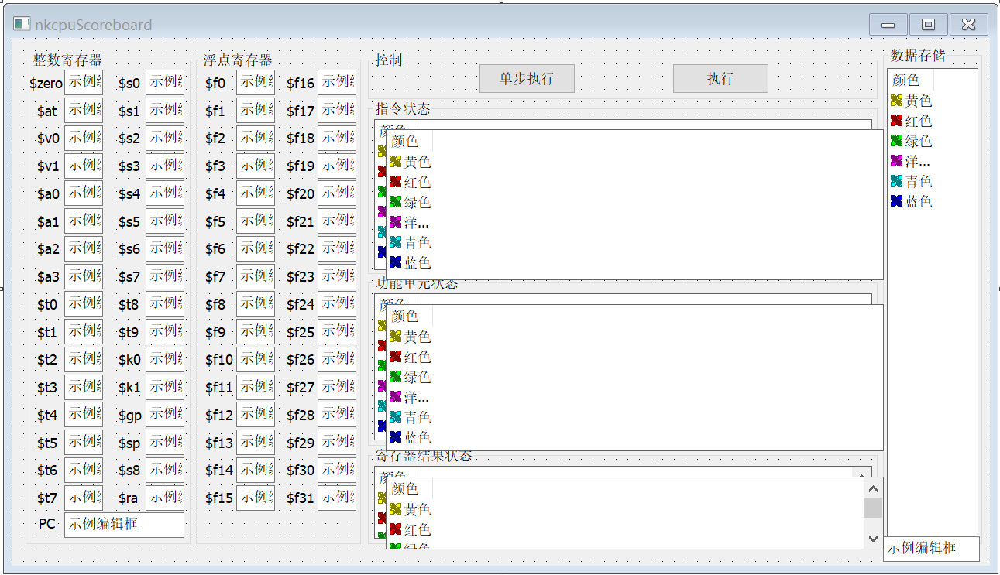
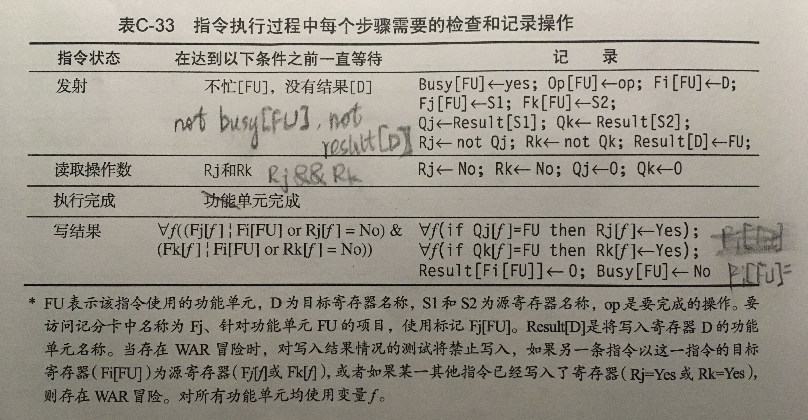
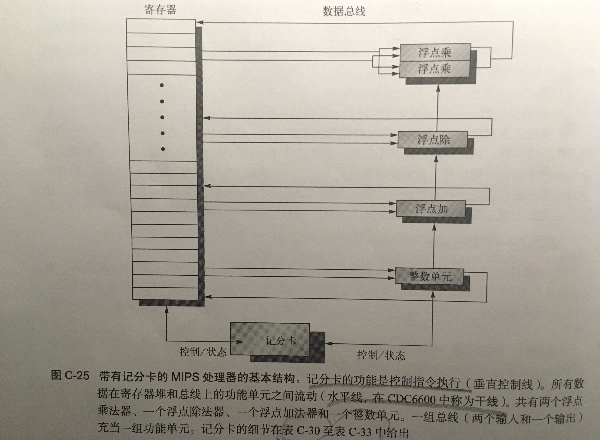
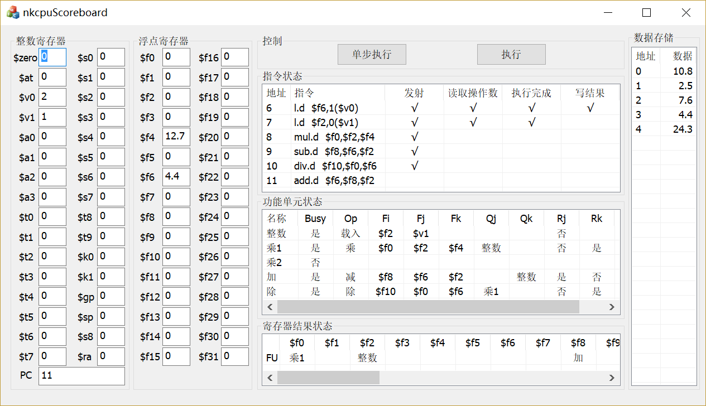
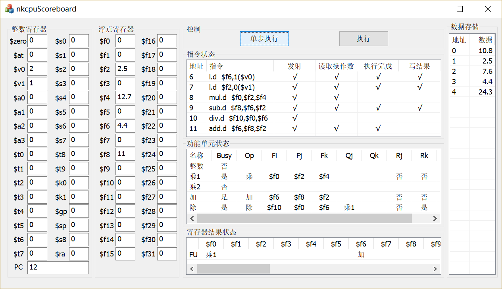
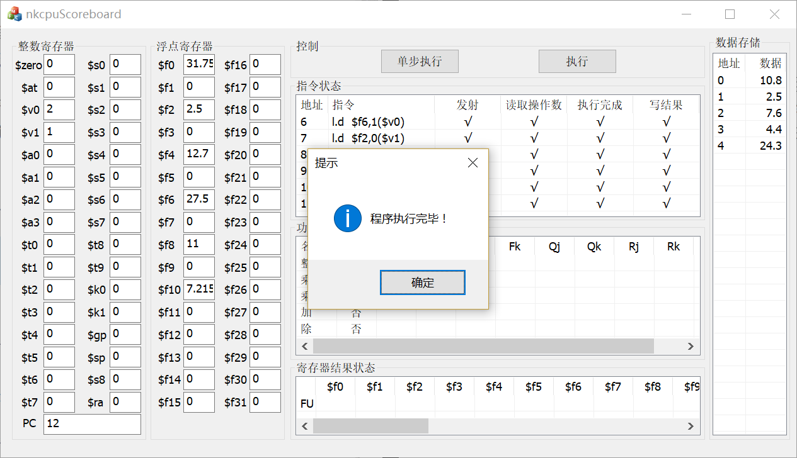
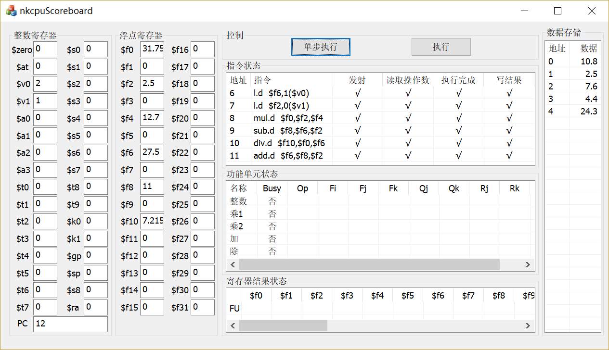

# 1. 实验名称
记分板调度方法仿真

# 2. 实验报告作者
**信息安全 1410658 杨旭东**

# 3. 实验内容
## 3.1. 定义 NK-CPU 指令流水线记分板仿真的基本数据结构
### 3.1.1 计分板
计分板数据结构是整个实验的核心，而实验要求可视化的计分板流程，所以我把计分板上所有需要用到的数据都存储在面板上，也就是实体可视化的数据结构。
<br>
如需使用其中数据，则直接从面板获取即可，如果修改了数据也及时更新到面板上。
<br>
另外，跟上一个实验一样，我同样是用了两套计分板，表示开始和结束两个状态，第二个计分板是隐藏的不可见，从设计图中可以看到.读取是从第一个计分板，更改放到第二个计分板上，这样避免了模拟过程中发生数据冒险和结构冒险（人为）。每个周期的最后将第二个计分板的值复制到第一个计分板，以达到目的。

## 3.2. 使用 C 语言实现 NK-CPU 指令流水线记分板仿真程序
### 3.2.1. 四个执行步骤
主要是更改计分板，具体操作均按照书中的提示来实现：<br>

>《计算机体系结构：量化研究方法（第五版）》 P510

*但是这个表格中判断条件不足，还需要根据指令状态计分板的数据来判断，只有前一个步骤完成之后后面的步骤才能执行。*

### 3.2.1.1. 发射
>nkcpuScoreboardDlg.cpp

```c++
void CnkcpuScoreboardDlg::发射()
{
    UpdateData(TRUE);
    CString ins = m_instate.GetItemText(m_PC - 6, 1);
    if (ins != "")
    {
        int FU;
        CString FUx;
        if (op == "载入" || op == "存储" || op == "分支" || op == "整数运算") { FU = 整数单元; FUx = "整数"; }
        else if (op == "加" || op == "减") { FU = 浮点加单元; FUx = "加";}
        else if (op == "乘") { FU = 浮点乘1单元; FUx = "乘1";if (m_funstate.GetItemText(FU, 0) == "是") { FU++; FUx = "乘2"; } }
        else if (op == "除") { FU = 浮点除单元; FUx = "除";}
        CString busy = m_funstate.GetItemText(FU, 1);
        CString result = m_result.GetItemText(0, rmap[D]+1);
        CString resultS1 = m_result.GetItemText(0, rmap[S1] + 1);
        CString resultS2 = m_result.GetItemText(0, rmap[S2] + 1);
        if (busy == "否"&&result == "")
        {
            m_instate1.SetItemText(m_PC - 6, 2, _T("√"));
            m_funstate1.SetItemText(FU, 1, _T("是"));
            m_funstate1.SetItemText(FU, 2, op);
            m_funstate1.SetItemText(FU, 3, D);
            m_funstate1.SetItemText(FU, 4, S1);
            m_funstate1.SetItemText(FU, 5, S2);
            m_funstate1.SetItemText(FU, 6, resultS1);
            m_funstate1.SetItemText(FU, 7, resultS2);
            m_funstate1.SetItemText(FU, 8, resultS1 == "" ? _T("是") : _T("否"));
            m_funstate1.SetItemText(FU, 9, resultS2 == "" ? _T("是") : _T("否"));
            CString pc;pc.Format(_T("%d"), m_PC);
            m_funstate1.SetItemText(FU, 10, pc);
            m_PC++;
            m_result1.SetItemText(0, rmap[D] + 1, FUx);
            UpdateData(FALSE);
        }
    }
}
```

### 3.2.1.2. 读取操作数
>nkcpuScoreboardDlg.cpp

```c++
void CnkcpuScoreboardDlg::读取操作数()
{
    for (int i = 整数单元;i <= 浮点除单元;i++)
    {
        CString Rj = m_funstate.GetItemText(i, 8);
        CString Rk = m_funstate.GetItemText(i, 9);
        if (Rj == "是"&&Rj == "是")
        {
            CString pc = m_funstate.GetItemText(i, 10);
            m_instate1.SetItemText(_ttoi(pc) - 6, 3, _T("√"));
            m_funstate1.SetItemText(i, 6, _T(""));
            m_funstate1.SetItemText(i, 7, _T(""));
            m_funstate1.SetItemText(i, 8, _T("否"));
            m_funstate1.SetItemText(i, 9, _T("否"));
            CString Fj = m_funstate.GetItemText(i, 4);
            CString Fk = m_funstate.GetItemText(i, 5);
            UpdateData(TRUE);
            B[i] = m_fReg[rmap[Fj]];
            C[i] = m_fReg[rmap[Fk]];
        }
    }
}
```

### 3.2.1.3. 执行完成
>nkcpuScoreboardDlg.cpp

```c++
void CnkcpuScoreboardDlg::执行完成()
{
    for (int i = 整数单元;i <= 浮点除单元;i++)
    {
        CString pc = m_funstate.GetItemText(i, 10);
        if (m_instate.GetItemText(_ttoi(pc) - 6, 3)=="√")
        {
            switch (i)
            {
            case 整数单元:
                m_instate1.SetItemText(_ttoi(pc) - 6, 4, 整数());
                break;
            case 浮点乘1单元:
                m_instate1.SetItemText(_ttoi(pc) - 6, 4, 浮点乘1());
                break;
            case 浮点乘2单元:
                m_instate1.SetItemText(_ttoi(pc) - 6, 4, 浮点乘2());
                break;
            case 浮点加单元:
                m_instate1.SetItemText(_ttoi(pc) - 6, 4, 浮点加());
                break;
            case 浮点除单元:
                m_instate1.SetItemText(_ttoi(pc) - 6, 4, 浮点除());
                break;
            }
        }
    }
}

```
执行涉及了之后的五个功能单元，因为彼此互相独立，所以均可以单独运行，所以在执行阶段有五个单元，下一步分会具体介绍。

### 3.2.1.4. 写结果
>nkcpuScoreboardDlg.cpp

```c++
void CnkcpuScoreboardDlg::写结果()
{
    for (int i = 整数单元;i <= 浮点除单元;i++)
    {
        CString pc = m_funstate.GetItemText(i, 10);
        if (m_instate.GetItemText(_ttoi(pc) - 6, 4) == "√")
        {
            CString FUx;
            switch (i)
            {
            case 整数单元:FUx = "整数";break;
            case 浮点乘1单元:FUx = "乘1";break;
            case 浮点乘2单元:FUx = "乘2";break;
            case 浮点加单元:FUx = "加";break;
            case 浮点除单元:FUx = "除";break;
            }
            CString FiFU = m_funstate.GetItemText(i, 3);
            bool term = 1;
            for (int j = 整数单元;j <= 浮点除单元;j++)
            {
                if (i != j)
                {
                    CString Fjf = m_funstate.GetItemText(j, 4);
                    CString Fkf = m_funstate.GetItemText(j, 5);
                    CString Rjf = m_funstate.GetItemText(j, 8);
                    CString Rkf = m_funstate.GetItemText(j, 9);
                    term = term && (Fjf != FiFU || Rjf == "否") && (Fkf != FiFU || Rkf == "否");
                }
            }
            if (term)
            {
                m_instate1.SetItemText(_ttoi(pc) - 6, 5, _T("√"));
                for (int j = 整数单元;j <= 浮点除单元;j++)
                {
                    if (i != j)
                    {
                        CString Qjf = m_funstate.GetItemText(j, 6);
                        CString Qkf = m_funstate.GetItemText(j, 7);
                        if (Qjf == FUx)m_funstate1.SetItemText(j, 8, _T("是"));
                        if (Qkf == FUx)m_funstate1.SetItemText(j, 9, _T("是"));
                    }
                }
                CString lastPC = m_funstate.GetItemText(i, 10);
                m_result1.SetItemText(0, rmap[FiFU] + 1, _T(""));
                m_funstate1.SetItemText(i, 1, _T("否"));
                m_funstate1.SetItemText(i, 2, _T(""));
                m_funstate1.SetItemText(i, 3, _T(""));
                m_funstate1.SetItemText(i, 4, _T(""));
                m_funstate1.SetItemText(i, 5, _T(""));
                m_funstate1.SetItemText(i, 6, _T(""));
                m_funstate1.SetItemText(i, 7, _T(""));
                m_funstate1.SetItemText(i, 8, _T(""));
                m_funstate1.SetItemText(i, 9, _T(""));
                m_funstate1.SetItemText(i, 10, _T(""));
                m_fReg[rmap[FiFU]] = ALUOutput[i];
                if (m_funstate.GetItemText(i, 2) == "载入")m_fReg[rmap[FiFU]] = LMD;
                UpdateData(FALSE);
            }
        }
    }
}
```

### 3.2.2. 五个功能单元
这五个功能单元都是在执行阶段可能用到的，时钟延迟我按着书上例题的假设来设置的，目的是更好的展示实验结果，其中，加法 2 个时钟周期，乘法 10 个时钟周期，除法 40 个时钟周期。也是仿照书上的设计来实现的。<br>

>《计算机体系结构：量化研究方法（第五版）》 P506

*其中的 pc 用来记录已经执行过的指令，由于多个始终周期，模拟的时候就简化了一下，在最后一个时钟周期来做，并更改相应的状态。*

#### 3.2.2.1. 整数单元
>nkcpuScoreboardDlg.cpp

```c++
CString pc1;
CString CnkcpuScoreboardDlg::整数()
{
    if (pc1 != m_funstate.GetItemText(整数单元, 10))
    {
        ALUOutput[整数单元] = B[整数单元] + C[整数单元];
        pc1 = m_funstate.GetItemText(整数单元, 10);
    }
    return _T("√");
}
```

#### 3.2.2.2. 两个浮点乘法单元
>nkcpuScoreboardDlg.cpp

```c++
int 浮点乘1剩余时间 = 10;
CString pc2;
CString CnkcpuScoreboardDlg::浮点乘1()
{
    if (pc2 == m_funstate.GetItemText(浮点乘1单元, 10))
    {
        return _T("√");
    }
    else
    {
        if (浮点乘1剩余时间 == 1)
        {
            ALUOutput[浮点乘1单元] = B[浮点乘1单元] * C[浮点乘1单元];
            浮点乘1剩余时间 = 10;
            pc2 = m_funstate.GetItemText(浮点乘1单元, 10);
            return _T("√");
        }
        else
        {
            浮点乘1剩余时间--;
            return _T("");
        }
    }
}

int 浮点乘2剩余时间 = 10;
CString pc3;
CString CnkcpuScoreboardDlg::浮点乘2()
{
    if (pc3 == m_funstate.GetItemText(浮点乘2单元, 10))
    {
        return _T("√");
    }
    else
    {
        if (浮点乘2剩余时间 == 1)
        {
            ALUOutput[浮点乘2单元] = B[浮点乘2单元] * C[浮点乘2单元];
            浮点乘2剩余时间 = 10;
            pc3 = m_funstate.GetItemText(浮点乘2单元, 10);
            return _T("√");
        }
        else
        {
            浮点乘2剩余时间--;
            return _T("");
        }
    }
}
```

#### 3.2.2.3. 浮点加法单元
>nkcpuScoreboardDlg.cpp

```c++
int 浮点加剩余时间 = 2;
CString pc4;
CString CnkcpuScoreboardDlg::浮点加()
{
    if (pc4 == m_funstate.GetItemText(浮点加单元, 10))
    {
        return _T("√");
    }
    else
    {
        if (浮点加剩余时间 == 1)
        {
            ALUOutput[浮点加单元] = B[浮点加单元] * C[浮点加单元];
            浮点加剩余时间 = 2;
            pc4 = m_funstate.GetItemText(浮点加单元, 10);
            return _T("√");
        }
        else
        {
            浮点加剩余时间--;
            return _T("");
        }
    }
}
```

#### 3.2.2.4. 浮点除法单元
>nkcpuScoreboardDlg.cpp

```c++
int 浮点除剩余时间 = 40;
CString pc5;
CString CnkcpuScoreboardDlg::浮点除()
{
    if (pc5 == m_funstate.GetItemText(浮点除单元, 10))
    {
        return _T("√");
    }
    else
    {
        if (浮点加剩余时间 == 1)
        {
            ALUOutput[浮点除单元] = B[浮点除单元] / C[浮点除单元];
            浮点加剩余时间 = 40;
            pc5 = m_funstate.GetItemText(浮点除单元, 10);
            return _T("√");
        }
        else
        {
            浮点加剩余时间--;
            return _T("");
        }
    }
}
```

### 3.2.3. 模拟时钟周期
#### 3.2.3.1. 单步执行
>nkcpuScoreboardDlg.cpp

```c++
// 使用按钮控制时钟周期，按一次算一个时钟周期
void CnkcpuPipelineDlg::OnBnClickedButton2()
{
    // TODO: 
    if (!endState)
    {
        写结果();
        执行完成();
        读取操作数();
        发射();
        int num=0;
        for (int i = 0;i < m_instate.GetItemCount();i++)
        {
            for (int j = 0;j < m_instate.GetHeaderCtrl()->GetItemCount();j++)
            {
                if (m_instate1.GetItemText(i, j) == "√")num++;
                m_instate.SetItemText(i, j, m_instate1.GetItemText(i, j));
            }
        }
        for (int i = 0;i < m_funstate.GetItemCount();i++)
        {
            for (int j = 0;j < m_funstate.GetHeaderCtrl()->GetItemCount();j++)
            {
                m_funstate.SetItemText(i, j, m_funstate1.GetItemText(i, j));
            }
        }
        for (int i = 0;i < m_result.GetItemCount();i++)
        {
            for (int j = 0;j < m_result.GetHeaderCtrl()->GetItemCount();j++)
            {
                m_result.SetItemText(i, j, m_result1.GetItemText(i, j));
            }
        }
        if (num == m_instate.GetItemCount()*(m_instate.GetHeaderCtrl()->GetItemCount() - 2))
            endState = 1;
    }
    else {
        MessageBox(_T("程序执行完毕！"), _T("提示"), MB_ICONINFORMATION);
    }
}
```
按一次按钮对四段做一次操作，并且根据计分板上的完成情况判断程序是否执行完成，以便使程序及时停下来。

#### 3.2.3.2. 执行
>nkcpuScoreboardDlg.cpp

```c++
void CnkcpuPipelineDlg::OnBnClickedButton1()
{
    // TODO: 在此添加控件通知处理程序代码
    while (!endState)
    {
        OnBnClickedButton2();
    }
    MessageBox(_T("程序执行完毕！"), _T("提示"), MB_ICONINFORMATION);
}
```
程序运行就是重复单步执行操作，直至程序结束。

## 3.3. 使用 NK-CPU 汇编语言编写记分板仿真程序的测试程序
由于之前的实验中排序运算只涉及了整数，没有浮点数，所以这次就要重新编写，而我直接用的书上的例子来做，也好检验成果。

我用的汇编语句是：
```asm
l.d     $f6 ,1($v0)
l.d     $f2 ,0($v1)
mul.d   $f0 ,$f2,$f4
sub.d   $f8 ,$f6,$f2
div.d   $f10,$f0,$f6
add.d   $f6 ,$f8,$f2
```

## 3.4. 获得测试结果并与实验 3 仿真测试结果进行比较
因为实验 3 中使用的都是整数单元，在本实验中会一直命中，所以相当于多周期顺序执行，并不能发挥计分板的作用，相比之下还是流水线的效率更高。

# 4. 实验设计依据
## 4.1. 阶段
<p>指令按顺序解码，并经过以下四个阶段。</p>

### 4.1.1. **发射：**
系统检查该指令将读取和写入哪个寄存器。这些信息被记住，因为它将在以下阶段需要。 为了避免输出相关性（ WAW - 写后写），指令停止，直到写入同一寄存器的指令完成。 当需要的功能单元当前正忙时，指令也停止。

### 4.1.2. **读取操作数：**
指令发出并正确分配给所需的硬件模块后，指令将等待所有操作数变为可用。 此过程解决读取依赖性（ RAW - 写后读），因为要写入另一条指令的寄存器在实际写入之前不被视为可用。

### 4.1.3. **执行：**
当所有操作数都被取出时，功能单元开始执行。 结果准备就绪后，记分牌被通知。

### 4.1.4. **写入结果：**
在此阶段，结果将被写入其目的寄存器。 但是，此操作会被延迟，直到早期的指令（意图读取此指令要写入的寄存器）已完成其读操作数阶段。 这样就可以解决所谓的数据依赖（ WAR - 读后写）。

## 4.2. 数据结构
<p>为了控制指令的执行，记分板维护三个状态表：</p>

- **指令状态：**对于正在执行的每个指令，表示其所处的四个阶段。
- **功能单元状态：**表示各功能单元的状态。 每个功能单元在表中维护 9 个字段：
    + Busy：指示本机是否正在使用
    + Op：在单元中执行的操作（例如 MUL ， DIV 或 MOD ）
    + Fi：目的地寄存器
    + Fj , Fk：源寄存器编号
    + Qj , Qk：将产生源寄存器 Fj , Fk 的功能单元
    + Rj , Rk：指示 Fj , Fk 是否准备就绪的标志
- **寄存器状态：**表示每个寄存器，哪个功能单元将其结果写入。

## 4.3. 算法
<p>记分牌控制的详细算法如下：</p>

```
Function issue(op, dst, src1, src2) 
    Wait until (!Busy[FU] AND !Result[dst]); // FU can be any functional unit that can execute operation op Busy[FU]  ←  Yes; 
    Op[FU]  ←  op; 
    Fi[FU]  ←  dst; 
    Fj[FU]  ←  src1; 
    Fk[FU]  ←  src2; 
    Qj[FU]  ←  Result[src1]; 
    Qk[FU]  ←  Result[src2]; 
    Rj[FU]  ←  not Qj; 
    Rk[FU]  ←  not Qk; 
    Result[dst]  ←  FU; 
```
```
Function read_operands(FU) 
    Wait until (Rj[FU] AND Rk[FU]); Rj[FU]  ←  No; 
    Rk[FU]  ←  No; 
```
```
Function execute(FU) 
    // Execute whatever FU must do 
```
```
Function write_back(FU) 
    Wait until  (∀f {(Fj[f]≠Fi[FU] OR Rj[f] = No] AND (Fk[f] ≠ Fi[FU] OR Rk[f] = No)]}
    for each f do 
        if   Qj[f]=FU   then   Rj[f]  ←  Yes; 
        if   Qk[f]=FU   then   Rk[f]  ←  Yes; 
    Result[Fi[FU]]  ←  0; 
    Busy[FU]  ←  No; 
```

## 4.4. 备注
<p>当没有功能单元可用时，记分板方法必须阻止问题阶段。 在这种情况下，未来可能执行的指令将等到结构性危险解决。 一些其他技术，如 Tomasulo 算法可以避免结构危害，并通过注册重命名解决 WAR 和 WAW 依赖关系。</p>

# 5. 实验结果与分析
## 5.1. 程序界面
<br>

## 5.2. 单步执行
<br>

## 5.3. 执行
<br>
<br>

实验结果基本符合预期。

# 6. 实验心得
经过前几次的磨砺，这次计分板正式增添了浮点数计算，所以我就没有重新把我的浮点数模块加进去，而是使用了书上的示例，这样复现原来的结果就好。我觉得重要在实验能力的培养上。期末作业比较多，所以拖到今天才整完，希望老师谅解。

# 7. 参考资料
[1] JohnL.Hennessy, DavidA.Patterson, 亨尼西,等. 计算机体系结构:量化研究方法[M]. 人民邮电出版社, 2013.<br>